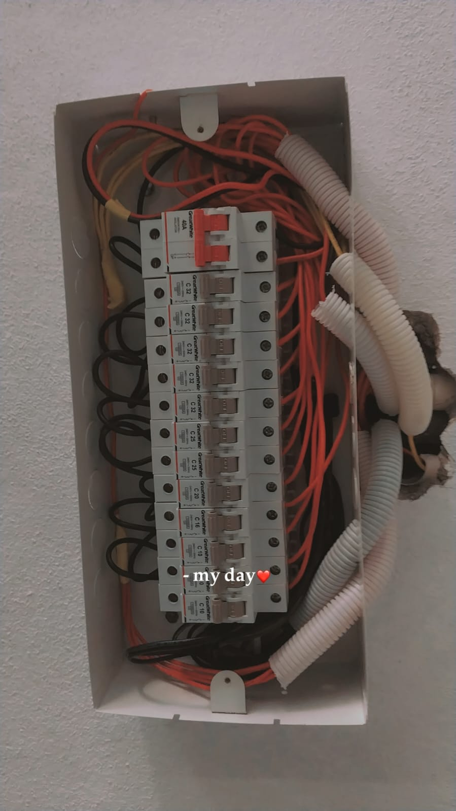

# Patel Electrition - Professional Electrical Solutions



A modern, high-performance landing page for a professional electrician business based in Nagpur, Maharashtra. Designed to convert visitors into clients with a premium aesthetic, clear pricing, and interactive animations.

## ✨ Features

- **Premium UI/UX**: Designed with a neutral, elegant color palette and modern typography (Playfair Display & Poppins).
- **Responsive Design**: Flawlessly adapts to all screen sizes (Desktop, Tablet, Mobile) ensuring a perfect experience everywhere.
- **Scroll Animations**: Smooth entrance animations powered by AOS (Animate On Scroll) to keep users engaged.
- **Dynamic Swiper Carousel**: An interactive sliding gallery to showcase past and recent projects.
- **Real-Time Map Integration**: Directly embedded Google Maps pointing to the business location.
- **Sticky Glassmorphism Header**: Navigation that adapts gracefully as you scroll down the page.
- **Quick Contact Options**: Floating WhatsApp button and clear call-to-action buttons.

## 🛠️ Technology Stack

- **HTML5**: Semantic structure.
- **Vanilla CSS3**: Custom styles, responsive media queries, CSS variables, and flex/grid layouts.
- **Vanilla JavaScript**: Lightweight DOM manipulation for header scrolling and menu toggling.
- **Swiper.js**: Robust library for touch-friendly carousels.
- **AOS.js**: Lightweight library for scroll-triggered animations.
- **FontAwesome 6**: Extensive library for beautiful icons.

## 🚀 Installation & Usage

Since this is a static website, you do not need any complex server setup.

1. **Clone or Download** the repository to your local machine.
2. **Open `index.html`** directly in any modern web browser (Chrome, Firefox, Safari, Edge).
3. **Alternatively**, use a local development server like VS Code's "Live Server" extension for hot reloading during development.

## 📁 File Structure

```text
├── index.html        # Main landing page (contains all HTML, CSS, and JS)
├── images/           # Directory containing all assets
│   ├── logo.jpeg             # Business logo
│   ├── electrician-hero.jpg  # Hero section image
│   ├── ceiling-wiring.jpg    # Why Choose Us image
│   ├── recent-work-1.jpg     # Carousel image 1
│   ├── recent-work-2.jpg     # Carousel image 2
│   └── ...                   # Other project images
└── README.md         # Project documentation
```

## 📝 Customization Guide

- **Colors**: You can easily change the theme by modifying the CSS variables found in the `:root` pseudo-class inside the `<style>` tag:
  ```css
  :root {
    --primary: #B89565;
    --primary-hover: #A38152;
    --bg-color: #FBF9F6;
    /* ... */
  }
  ```
- **Images**: To update images, replace the files in the `images/` directory, ensuring you keep the exact file names, or update the `src` paths in the HTML.
- **Pricing**: Update the prices directly in the "Our Charges" section within the HTML grid cards.

---

<div align="center">
  <p>Made with ❤️ by an awesome developer.</p>
  <p>
    <a href="mailforadithyan@gmail.com">Contact Developer</a> • 
    <a href="https://adithyan-portfolio.pages.dev/">View My Portfolio</a>
  </p>
</div>
